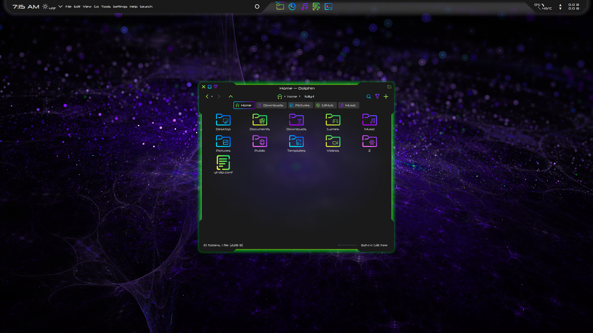
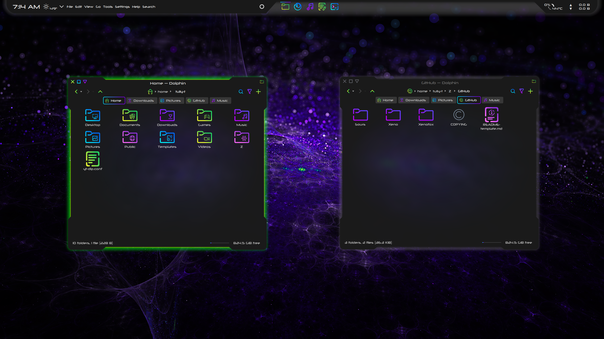

# Xeno Window Decoration

The Xeno window decoration is a dark theme for Aurorae with an alien shape and a cyberpunk glow.

## Features

- Active window glow
- Inactive window inverted shadow - window edges are always apparent
- Close, maximize, and minimize buttons grow when hovered and glow when pressed
- No korners

## Installation

- Download and extract [Xeno-main.zip](https://github.com/tully-t/Xeno)
- Open the Aurorae folder
- Copy the Xeno folder to ~/.local/share/aurorae/themes
- We now have a ~/.local/share/aurorae/themes/Xeno
- In System Settings -> Appearance -> Window Decorations, select Xeno and click Apply

## Recommendations

- In System Settings -> Appearance -> Window Decorations -> Titlebar Buttons: Use the 'More actions for this window' button to display the application icon (unfortunately the 'Application menu' button is coded to hide the icon on windows without a global menu)
- Install gtk3-nocsd (gtk3-nocsd-git in the AUR) to disable client-side decorations for gtk3 apps https://github.com/fredldotme/gtk3-nocsd / https://aur.archlinux.org/packages/gtk3-nocsd-git
- Use with the [Xeno Kvantum theme](https://github.com/tully-t/Xeno/tree/main/Kvantum)
- Use with the [Sour icon set](https://github.com/tully-t/Sours)

## Customization

- Always make a backup first
- Feel free to experiment! Make the theme work for you

Theme files are located in ~/.local/share/aurorae/themes/Xeno

- Xenorc:
    - The [General] section: contains alignment, color, and shadow options for the Title text. Other options can be chosen in the System Settings -> Appearance -> Window Decorations GUI
    - The [Layout] section: contains integer values that are used to scale the parameters of the corresponding components of the window frame, as well as the window buttons. A more in-depth explanation can be found in the KDE documentation here: https://develop.kde.org/docs/plasma/aurorae/

    The visual representation of the Aurorae layout at https://techbase.kde.org/User:Mgraesslin/Aurorae#Layout is particularly helpful for guiding modification

- decoration.svg:

    - The window frame components are sourced from decoration.svg. For example, the values of Border Left and Padding Left are added together to scale decoration-left in decoration.svg

    - I recommend using Inkscape to modify decoration.svg

    - The Xeno window decoration uses relatively large padding values in [Layout] to dramatically extend the window frame outwards. The elements in decoration.svg are stretched to the size of the window. The Xeno window decoration utilizes this effect to produce extruding corners with an aggressive slope on either side of indents in the window frame

    - The color of the active shadow can be modified by changing the colors of the path in the shadow elements of decoration.svg. For example, in decoration-left, there is an element named shadow-left. There is a path inside shadow-left that is the shadow itself. The path's fill is a gradient. Change the color of the gradient stops as you wish, but to keep the same shadow strength, keep the set opacity of the gradient stops

- Buttons (close, minimize, maximize, restore):

    - Glow or shrink? The Xeno window decoration manipulates the pressed- state of these buttons to produce a glow psuedo-animation. To opt for a shrinking effect instead, rename the corresponding .svg files. The name without a -suffix is the .svg used by the theme. For example:
        - First, rename the glowing button to deactivate it: Xeno/close.svg -> Xeno/close-glow.svg
        - Then, rename the shrinking button to activate it: Xeno/close-shrink.svg -> Xeno/close.svg

### Minimum window width
- As you may have noticed from the theme preview in System Settings -> Appearance -> Window Decorations, if the window is very small, the titlebar buttons no longer fit in the decoration's extruded corner. To avoid this glitchy look, set a Window Rule for minimum width and height:
    - In System Settings -> Window Management -> Window Rules, select "Add New..." in the bottom left
    - Add a description, for example, "Minimum Window Width"
    - For window class, use the dropdown menu to select "Regular Expression"
    - In the text field to the right of the dropdown, paste the following to exclude Latte Dock from the rule: `^(?!.*\bplasma\b).*$`
    - For "Match whole window class", select Yes
    - For window types, uncheck "All Window Types" to uncheck all of them, and then check "Normal Window" and "Dialog Window" for a total of 2
    - Select "Add Property..." in the lower left and scroll down to choose "Minimum Size"
    - In the line that appears, set the minimum size to 540 (width first) x 80 (height last)
        - If the minimum height is set too high, some dialogs can appear disproportionately tall

## Contributing

Please open an issue if you notice any bugs, errors, or unexpected behavior.

## License

This project is licensed under the GNU GPL v3 - see the [LICENSE.md](LICENSE.md) file for details.

## Acknowledgments

This window decoration is originally based on the [Ghost-Deco](https://github.com/jmtodaro/Ghost-Deco) window decoration by jmtodaro.

