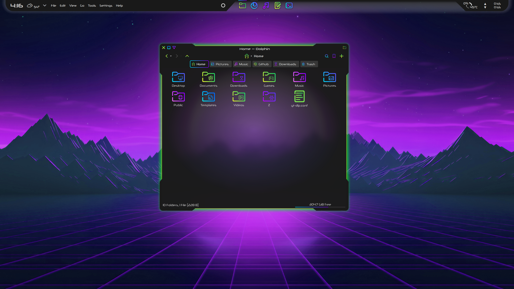
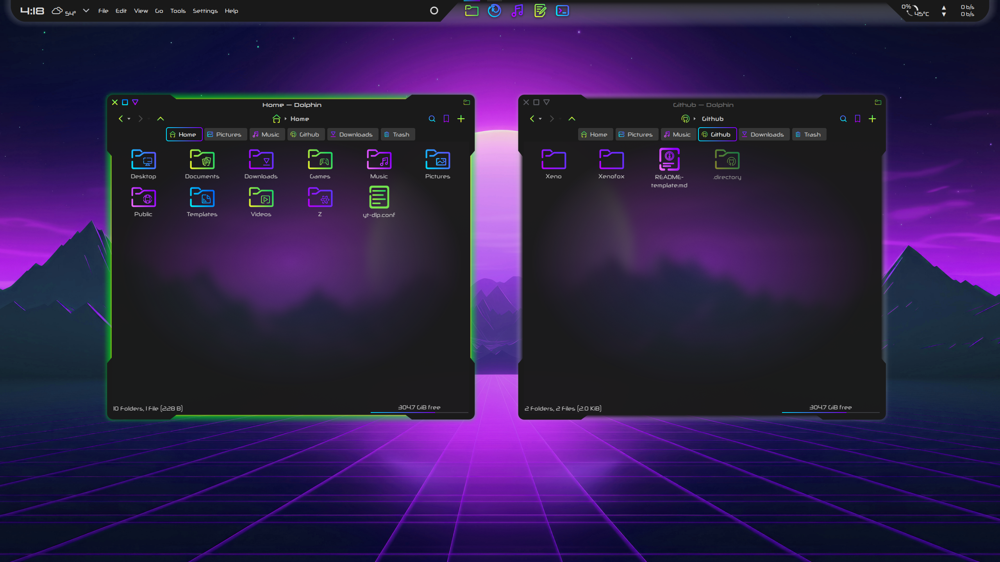
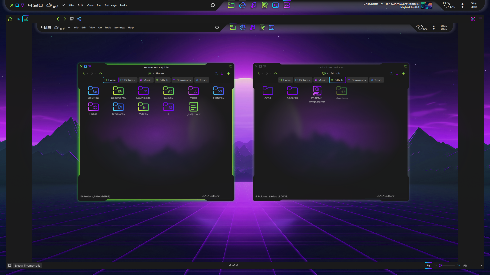

# Xeno Window Decoration

The Xeno window decoration is a dark theme for Aurorae with an alien shape and a cyberpunk glow.

## Features:

- Active window glow
- Inactive window inverted shadow - window edges are always apparent
- Close, maximize, and minimize buttons grow when hovered and glow when pressed
- No korners

## Installation:

- Download and extract Xeno-main.zip
- Open the Aurorae folder
- Copy the Xeno folder to ~/.local/share/aurorae/themes
- We now have a ~/.local/share/aurorae/themes/Xeno
- In System Settings -> Appearance -> Window Decorations, select Xeno and click Apply (lower right)

## Recommendations:

- In System Settings -> Appearance -> Window Decorations -> Titlebar Buttons: Use the 'More actions for this window' button to display the application icon (unfortunately the 'Application menu' button is coded to hide the icon on windows without a global menu)
- Install gtk3-nocsd (gtk3-nocsd-git in the AUR) to disable client-side decorations for gtk3 apps https://github.com/fredldotme/gtk3-nocsd / https://aur.archlinux.org/packages/gtk3-nocsd-git
- Use with the Xeno Kvantum theme
- Use with the Sour icon set
- Use with the Minimize Zoom desktop effect

## Customization:

- Always make a backup first
- Feel free to experiment! Make the theme work for you

Theme files are located in ~/.local/share/aurorae/themes/Xeno

- Xenorc:
    - The [General] section: contains alignment, color, and shadow options for the Title text. Other options can be chosen in the System Settings -> Appearance -> Window Decorations GUI
    - The [Layout] section: contains integer values that are used to scale the parameters of the corresponding components of the window frame, as well as the window buttons. A more in-depth explanation can be found in the KDE documentation here: https://develop.kde.org/docs/plasma/aurorae/

    The visual representation of the Aurorae layout at https://techbase.kde.org/User:Mgraesslin/Aurorae#Layout is particularly helpful for guiding modification

- decoration.svg:

    - The window frame components are sourced from decoration.svg. For example, the values of Border Left and Padding Left are added together to scale decoration-left in decoration.svg

    - I recommend using Inkscape to modify decoration.svg

    - The Xeno window decoration uses relatively large padding values in [Layout] to dramatically extend the window frame outwards. The elements in decoration.svg are stretched to the size of the window. The Xeno window decoration utilizes this effect to produce extruding corners with an aggressive slope on either side of indents in the window frame

    - The color of the active shadow can be modified by changing the colors of the path in the shadow elements of decoration.svg. For example, in decoration-left, there is an element named shadow-left. There is a path inside shadow-left that is the shadow itself. The path's fill is a gradient. Change the color of the gradient stops as you wish, but to keep the same shadow strength, keep the set opacity of the gradient stops

- Buttons (close, minimize, maximize, restore):

    - Glow or shrink? The Xeno window decoration manipulates the pressed- state of these buttons to produce a glow psuedo-animation. To opt for a shrinking effect instead, rename the corresponding .svg files. The name without a -suffix is the .svg used by the theme. For example:
        - First, rename the glowing button to deactivate it: Xeno/close.svg -> Xeno/close-glow.svg
        - Then, rename the shrinking button to activate it: Xeno/close-shrink.svg -> Xeno/close.svg

## Notes:

#### Minimum window width:
- As you may have noticed from the theme preview in System Settings -> Appearance -> Window Decorations, if the window is very small, the titlebar buttons no longer fit in the decoration's extruded corner. To avoid this glitchy look, set a Window Rule for minimum width and height:
    - In System Settings -> Window Management -> Window Rules, select "Add New..." in the bottom left
    - Add a description, for example, "Minimum Window Width"
    - For window class, use the dropdown menu to select "Regular Expression"
    - In the text field to the right of the dropdown, paste the following to exclude Latte Dock from the rule: `^(?!.*\blattedock\b).*$`
    - For "Match whole window class", select Yes
    - For window types, uncheck "All Window Types" to uncheck all of them, and then check "Normal Window" and "Dialog Window" for a total of 2
    - Select "Add Property..." in the lower left and scroll down to choose "Minimum Size"
    - In the line that appears, set the minimum size to 540 (width first) x 80 (height last)
        - If the minimum height is set too high, some dialogs can appear awkward

#### Maximized windows:

- To have gaps around maximized windows like the screenshot, the most amenable approach is to create 'empty' (spacer) Latte docks on each screen edge. KWin scripts for window gaps exist, but they come with their own special downsides. The "Maximized Window Gap" KWin script is not configurable (default gap too small), and the "Window Gaps" KWin script has goofy resizing behavior, and also does not remember unmaximized window sizes
- Prerequisite: install the handy "Show Desktop (Win 7)" widget using Discover
- If you already have a top dock/panel, start with a different screen edge
- Right-click your existing Latte dock/panel, select "Add Dock/Panel", and then select "Empty Panel" (Latte will choose an unclaimed screen edge for the new dock)
- Add a Latte Spacer and a "Show Desktop (Win 7)" widget to the empty panel/dock to keep track of them and retain the ability to right-click them. Verify the new 'empty' panel/dock contains nothing else
- Set "Show Desktop (Win 7)" to have a size of 48px and a transparent 'Edge' color but a visible 'Hovered' color, to be able to find the spacer dock with the cursor
- "Show Desktop (Win 7)" has options for click and mouse wheel actions. To prevent any actions from running, set both to "Run Command(s)" but leave the text entry fields blank
- Right-click on the spacer or "Show Desktop (Win 7)" widget in the new spacer dock and select "Edit Dock"
    - On the "Behavior" tab, ensure "Visibility" is set to "Always Visible"
    - On the "Appearance" tab, set "Absolute size" to 30px (adjustable). Ensure the slider for "Relative size" is pulled entirely to the left (the value should read -- %), that no margins or floating gap are set, that the "Length" maximum is at least 6% (to keep the dock findable, screen size dependent)
    - Ensure that the switch for "Background" is deactivated
    - On the "Effects" tab, ensure all effects are deactivated

- For the other two edges (not the top edge):
    - Right-click your first spacer dock (using the Latte Spacer or "Show Desktop (Win 7)" widget)
    - Select "Add Dock/Panel"
    - Select "Duplicate Dock"
    - Right-click the newly created duplicate dock and select "Edit Dock"
    - At the top of the "Behavior" tab, set "Screen" to Bottom/Left/Right

- For the top spacer dock:
    - Right-click an existing side/bottom spacer dock (using the Latte Spacer or "Show Desktop (Win 7)" widget)
    - Select "Add Dock/Panel"
    - Select "Duplicate Dock"
    - Right-click the newly created duplicate dock and select "Edit Dock"
    - On the "Appearance" tab, set "Absolute size" to 78px (to match the other gaps while accounting for the presence of a top panel/dock) (adjustable depending on the size of your visible top panel/dock)
    - On the "Appearance" tab, ensure that "Length" is set to something small, like 6%
    - At the top of the "Behavior" tab, set "Screen" to Bottom (if that is not the case already)
    - Note whether this dock is left- or right-aligned (on the "Behavior" tab). You may prefer a left or right alignment for the top spacer dock depending on your panel/dock setup. I have my top spacer dock right-aligned and I set the Mouse Wheel actions to "volume UI (qdbus)" to scroll to change volume in the top-right corner.

    - On the "Behavior" tab, set "Screen" to Top
    - You may need to left-click on your actual top dock/panel to raise it above the spacer dock, just once

    - Right-click the on the "Show Destkop (Win 7)" widget in the newly created duplicate dock (it should be clickable below your already-present top panel/dock, since it is 78px tall)
    - Select "Configure Show Destkop (Win 7)"
    - Set the "Hovered" color to have 0 alpha/opacity (to hide it. After this step, you will have to right-click around in the proper corner to find the top spacer dock. You've found it when you have a "Configure Show Desktop (Win 7)" option in your context menu
    - To remove spacer docks that you can't find with your cursor:
        - Right-click a visible Latte dock
        - Select "Layouts" -> "Edit Layouts" (at the bottom)
        - In the Latte window that pops up, select "Docks, Panels..." (on the right)
        - In the "Docks/Panels" window, if you only have a top panel/dock visible, then the docks on the left, right, and bottom are spacer docks.
            - Use the visualization in the Name column to identify the spacer dock on the top edge (it will be left- or right-aligned as you set it and will not be floating)
        - Select (left-click) and remove (button on right) docks you no longer need

## Contributing

Please open an issue if you notice any bugs, errors, or unexpected behavior.

## License

This project is licensed under the GPL v3.0 License

## Acknowledgments

This window decoration is originally based on the [Ghost-Deco](https://github.com/jmtodaro/Ghost-Deco) window decoration by jmtodaro.

