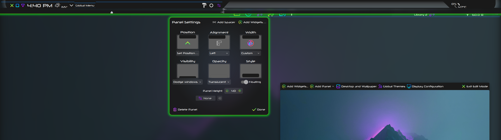

# Xeno Conky Theme

Provides an angled panel background and a system monitor gauge. Intended to be used in combination with a transparent panel. Matches the Xeno Aurorae window decoration.

With panel, including global menu and media player:

Just the conky, no panel:

System monitor gauge labels:

## Installation

- Download and extract [Xeno-main.zip](https://github.com/tully-t/Xeno)
- Open the Conky folder
- Copy the conky folder inside to your home holder
- Rename ~/conky/ to ~/.conky/ (will make the folder hidden)
- We now have a ~/.conky/ folder containing the Xeno Conky theme content: ~/.conky/lua, conky-xeno.conf, conky.desktop, start_conky.sh, and xenobar.svg. ~/.conky is the location the theme expects

- Ensure the [Neuropolitical font](https://www.dafont.com/neuropolitical.font) is intalled (or modify conky-xeno.config to use another)

- Ensure `conky` is [installed](https://github.com/brndnmtthws/conky/wiki/Installation) with the correct build flags. If you only want the panel background without a gauge, Lua is not necessary and the standard package in any distribution is fine.

If you want to use the gauge, and you use Arch, note that the standard Arch package [`conky`](https://archlinux.org/packages/extra/x86_64/conky/) unfortunately does not support the necessary Lua bindings. I use the [`conky-cairo`](https://aur.archlinux.org/packages/conky-cairo) package from the AUR because it suits my needs. You can also very easily compile `conky` from source yourself.
    - To install `conky-cairo` from the AUR: `yay -S conky-cairo`

- If you have Conky installed, scroll past Compilation to Using Conky

#### Compilation
- To compile `conky` from source:

    1. Install [dependencies](https://github.com/brndnmtthws/conky/wiki/Installation). On my system, I discovered in step 6a that I needed to additionally install `gperf`

    2. `git clone https://github.com/brndnmtthws/conky.git` (download source)

    3. `cd conky` (go to folder with downloaded source code)

    4. `mkdir build` (make a build folder)

    5. `cd build` (go to build folder)

    6. `ccmake ..` (choose build flags here)

        6a. `c` (initialize configuration, the cache will initially be empty)
        - If cmake or another dependency is not installed, this is the step you find out. If that is the case, no worries. If cmake was installed, use the `q` command to quit without generating, install the necessary dependencies, and try this step again. If cmake was not installed, install cmake and try this step again. You can always delete ~/conky from your home folder and start fresh at step 2.
        6b. `e` (exit the configuration initialization process after it finishes)
            - This will bring you to the configuration page where you enable build flags
            - Ensure the non-default flags relevant to the config are `ON` before proceeding (all on Page 2):
                - BUILD_LUA_CAIRO - to draw the gauge
                - BUILD_LUA_CAIRO_XLIB
                - BUILD_LUA_IMLIB2
                - BUILD_LUA_RSVG
                - BUILD_NVIDIA - important if you have an Nvidia GPU
                - BUILD_WAYLAND - important if you use the Wayland compositor

        6c. `c` (generate configuration patch)

        6d. `e` (exit configuration patch generation)

        6e. You have arrived back at the configuration page but the first item in the list is now `APP_PATCH`. Press `c` again to process configuration with the patch

        6f. `e` (exit configuration processing)

        6g. You have arrived back at the configuration page, but a new `[g] Generate` option has appeared in the Keys section at the bottom. Press `g` to generate the configuration and exit the cmake terminal interface

    7. `cmake --build build` (compiles Conky - this step takes a few minutes)

    8. `cmake --install build` (places the Conky executable in /usr/bin)

## Using Conky
Conky runs from the command line. `conky` will run Conky using the default configuration, a solid black rectangle with sharp corners and lots of system information. The `-c` option tells Conky to use a config file different from the default. Next, supply the location of your config file. The Xeno theme expects to be installed in ~/.conky but any location in your home folder is valid. The `--daemonize` flag tells Conky to run in the background, and `'>>' /dev/null '2>&1'` pipes any output from Conky to the void (both are part of the command so you can close the terminal window and Conky will stay running).

- To run `conky` with the Xeno theme from the expected location, as a background process:

    `conky -c ~/.conky/conky-xeno.conf --daemonize '>>' /dev/null '2>&1'`
    - Note: The Lua component of the config will not initially be functional and will produce an error. This is because it requires an absolute path that must be edited manually. In ~/.conky/conky-xeno.conf, in the `lua_load` line, replace "username" with your actual username to make it functional

- Conky sizing is determined by your screen resolution. The Xeno Conky theme is designed for a 2560x1440 screen. If you have a different resolution, you will need to adjust the horizontal spacing (goto and alignr parameters, minimum width config) as well as image size

## CPU temperature command
Conky uses hwmon to gather information from the motherboard. Hwmon is notorious for loading devices in a different order every boot, yet most hwmon documentation uses hwmon device numbers in their commands, which leads to the command breaking every reboot - it's asinine.

To avoid that, the hwmon command in this Conky theme _names_ the device to specify it, rather than using its device number: `${hwmon asusec temp 2}`

In this command, `asusec` is the name of my motherboard, and `temp 2` is the sensor that I want to read. This may not be the same for you - your motherboard may have a different name, and `temp 2` may not be the sensor you want to read. To determine which hwmon device and sensor to display in your Conky gauge, navigate to `/sys/class/hwmon/` and check the "name" file in each numbered folder to discover devices, and then check the sensor label files (e.g. temp1_label) to discover particular sensors. This is the proper format for hwmon commands:

`${hwmon [device name] [sensor] [sensor number]}`

### Panel background only - no gauge
To use the Xeno Conky theme as a panel background only, without a gauge:
- Open conky-xeno.conf with your text editor of choice
- Delete the two lines that begin with 'lua,' line 37 & 38
    - Line 37: `lua_load = '/home/username/.conky/lua/conky_draw.lua',`
    - Line 38: `lua_draw_hook_pre = 'main',`

### Start Conky on boot (KDE)
First, modify the supplied `conky.desktop` file: open it with a text editor, and on the "Exec" and "Path" lines, replace "username" with your actual username.

Place the supplied `conky.desktop` file in ~/.config/autostart manually, or use the wizard in System Settings -> Autostart to add a start-up application and browse for `start_conky.sh` (ensure that the .desktop file that System Settings generates includes the same options that are in the supplied `conky.desktop` file).

The supplied `conky.desktop` file executes the supplied `start_conky.sh`, which uses the `sleep` command to wait 3 seconds before executing the `conky -c ~/.conky/conky-xeno.conf --daemonize '>>' /dev/null '2>&1'` command. This gives KDE more than enough time to boot properly before launching Conky.

Note: Autostart .desktop files require absolute paths to function. Open `conky.desktop` with a text editor, and on the "Exec" and "Path" lines, replace "username" with your actual username.

### Plasma Panel configuration
- Dimensions:
    - Height: 40
    - Width: Custom
    - Style: Floating
- Transparency: use [Panel Colorizer](https://store.kde.org/p/2130967) to make the panel background transparent, it also allows for margin correction and provides a drop shadow for the dock icons and media player
- The top panel with center dock in the screenshots actually consists of two side-by-side panels with a custom width, one left-aligned and one right-aligned
- On Wayland, two side-by-side panels can be achieved by avoiding the 'Always Visible' Visibility option (I use Dodge Windows) (bug: https://bugs.kde.org/show_bug.cgi?id=477939)
- In edit mode, use the 'Drag to change maximum/minimum width' sliders to align the panels on either side of the middle slant
- Use [Panel Spacer Extended](https://www.pling.com/p/2128047) for explicit control over spacer length and additional panel actions (e.g. scroll to change volume (kmix), double-click to maximize/restore windows)
- Left Panel (from left):
    - Panel Spacer Extended (fixed size: 31px, tooltip disabled, hover effect disabled)
    - Window Buttons (use metrics from decoration, slide out, show when active window maximized, left margin: 0, right margin: 4px)
    - Digital Clock (font: 18pt Neuropolitical)
    - Panel Spacer Extended (fixed size, 6px, tooltip disabled, hover effect disabled)
    - [Weather Widget 2](https://github.com/blackadderkate/weather-widget-2) (modified) (font style: - Neuropolitical, font size: 26px)
    - System Tray
    - Global Menu
    - Panel Spacer Extended (flexible size, tooltip disabled, hover effect disabled)
    - Panel Colorizer (enabled, hide widget, panel background: hide)
        - Layout: Background Margin (Spacing: 4, Vertical: 4, Horizontal: 0)
        - Layout - Extra Margin: Global Menu (Vertical: 1, Horizontal: 0)
    - Simple Application Launcher
- Right Panel (from right):
    - Panel Spacer Extended (fixed size: 32px, tooltip disabled, hover effect disabled)
    - [Netspeed Widget](https://store.kde.org/p/2136505) (modified) (upload first, use shortened speed units)
    - Panel Spacer Extended (flexible size, tooltip disabled, hover effect disabled)
    - Panel Colorizer (enabled, hide widget, panel background: hide)
        - Text and Icons (enabled, static color mode, fix custom badges)
            - Colors (source: system, color: text, color set: view, opacity: 1.0)
            - Shadow (enabled, color: #69000000, strength: 6, x offset: 1, y offset: 1)
        - Blacklist: Netspeed Widget
        - Layout: Background Margin (Spacing: 4, Vertical: 4, Horizontal: 0)
        - Layout - Extra Margin: Icons-only Task Manager (Vertical: -4, Horizontal: 0)
    - Icons-only Task Manager (__not__ filling free space on panel, for compatibility with Panel Spacer Extended flexible size, and set icons to appear to the right)
- Screenshots of Plasma Panel configuration:

### Keep Conky below other windows/panels (KDE)

- To keep Conky underneath the panel as a background, use a Window Rule to force Conky to the 'Below' window layer:
    - In System Settings -> Window Management -> Window Rules, click "Add New..."
    - For "Window class (application)", select "Exact Match" and type conky
    - Click "Add Property..." and select "Layer" at the very bottom
    - Use the dropdown menu to change "Normal" to "Below", and click "Apply"
    Note: Unfortunately Conky will still prevent any clicks from reaching the toolbar that pops up along the panel in Edit mode. You can use `killall conky` to quit Conky before opening Edit mode.

## Customization

- Always make a backup first

- Feel free to experiment! Make the theme work for you

### Config Customization

- The config section of conky-xeno.conf is split into subsections for easier navigation: Runtime, Own Window, Alignment, Font, Metadata, and Lua. Notes about pertinent config options:

#### Own window
- own_window_type: I have found that `'dock'` provides the best results on KDE. The other options are normal, desktop, panel, utility, and override. 'Normal' widows are given window decorations, and KDE has strong opinions about the placement and opacity of 'panel' windows (to be avoided). 'Desktop' and 'override' are not functional options on KDE, and 'utility' is functionally similar to 'normal'.
- own_window_hints: On Wayland, I have found that the 'below' option is ignored or otherwise not functional. KDE supports wlr_layer_shell, so you can use a Window Rule to force Conky to the 'below' window layer.
- own_window_argb_value: 0, for transparency
- use_xft: true, for transparency
- draw_blended: false, to allow drawing other images on top, just to keep the possibility open

#### Lua
- lua_load: must be an absolute path (no ~/) (replace "username" with your actual username. If you put your Conky folder somewhere other than the default location, replace the entire path)

### Lua Customization
The Xeno Conky theme uses the conky-draw Lua library to draw the system monitor gauge.

- The lua files are located in the ~/.conky/lua folder
- conky_draw.lua is the library itself - don't edit this file
- conky_draw_config.lua is the config file where graphs are defined - edit this file
    - Templates can be found [here](https://github.com/fisadev/conky-draw)
    - freq_g (CPU frequency): the min and max values will need to be adjusted to your system. On a desktop, reported CPU frequency rarely drops to the minimum. I set a min value of 4.2 and a max value of 4.8 to restrict the graph to the top of my frequency range - this way, the graph movement is more significant and the graph gives more useful information.

### Text Customization
The text section follows the config section. Lines in this section display meters (text, images, or graphs) in the conky window. Specify position, font, size, color for each line.

- Templates can be found [here](https://github.com/brndnmtthws/conky/wiki/Configs)
- "goto" (left alignment) positioning is absolute, while "alignr" (right alignment) positioning is relative - if you add text, you will likely need to adjust any alignr values
- "voffset" (vertical alignment) is entirely relative from the first line/meter, excluding images. Positive values go down and negative values go back up. Font size will affect "voffset"
- hwmon - the devices to which hwmon labels refer will be different depending on your hardware. In /sys/class/hwmon/ check the "name" file in each numbered folder to discover devices, and then check the sensor label files (e.g. temp1_label) to discover particular sensors. I personally use the motherboard's sensor for CPU temp simply because that reading is generally lower than k10temp
- Images - the background image is on the final line so other things go on top. Image positioning is absolute

### Contributing

Please open an issue if you notice any bugs, errors, or unexpected behavior.

### License

This project is licensed under the GNU GPL v3 - see the [LICENSE.md](LICENSE.md) file for details.

### Acknowledgments

The Xeno Conky theme is made possible by [conky-draw](https://github.com/fisadev/conky-draw), a Lua library for Conky graphs by [fisadev](https://github.com/fisadev), as well as [brndnmtthws](https://github.com/brndnmtthws) and everyone who keeps Conky "one of the best maintained, and definitely one of the most useful, programs in the world of open source" ([Rahm 2](https://web.archive.org/web/20131212032148/http://www.linux-magazine.com/w3/issue/100/086-087_conky.pdf)).
