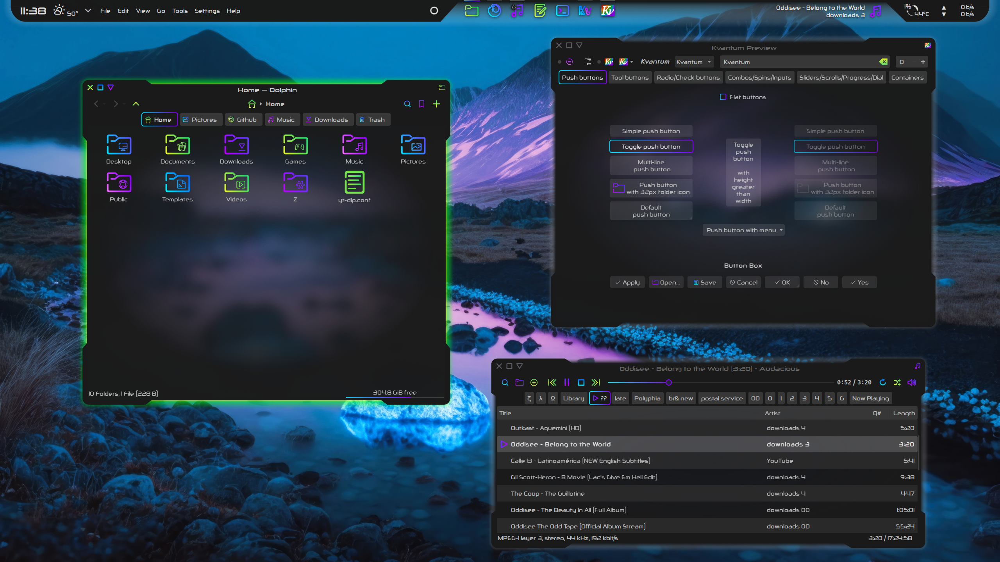

# Xeno Kvantum Theme

Xeno is a dark theme for Kvantum with colorful gradients, transparency, and a radial window background.

## Installation:

- First, ensure `kvantummanager` is installed. The package name could also be `kvantum`, `kvantum-qt5`, or `qt5-style-kvantum` depending on your distribution

- Download and extract Xeno-main.zip
- Open the Kvantum folder
- Copy the Xeno folder to ~/.config/Kvantum/ (create if necessary)
- We now have a ~/.config/Kvantum/Xeno
- In Kvantum Manager -> Change/Delete Theme, use the 'Select a theme' dropdown menu to select Xeno, and press 'Use this theme' to apply the theme

## Recommendations:

- Use with the Xeno color scheme
- Use with the Xeno Aurorae window decoration theme
- Use with the Sour icon set
- Use with the Xeno Konsole theme
- Use with the Xeno-gtk GTK theme
- Use with the Xenofox Firefox theme

## Notes:

- Where did the close buttons on my tabs in Dolphin go?

    Use middle-click or Ctrl+W to close tabs. Without a close button, it is much harder to accidentally close a tab when you meant to select or move it. I wish Dolphin had a GUI setting for this. To reveal the close button on tabs in Dolphin, change the indicator.size value in the [Tab] section of ~/.config/Kvantum/Xeno/Xeno.kvconfig to 8 or higher.

- Blur:

    - In System Settings -> Workspace Behavior -> Desktop Effects, find the Blur row and ensure it is checked.
    - Press the customize button on the right to open the Blur Settings dialog window
    - Set Blur Strength to 6 (from Light/left)
    - Set Noise Strength to 9 (from Light/left)

## Customization:

- Always make a backup first

- Feel free to experiment! Make the theme work for you

- Use Inkscape to modify Xeno.svg. Modification using a text editor is not particularly recommended for this bad boy, however, an exception can be made for using the 'Find & Replace' function to modify colors - for example, to modify the gradient from blue-purple to yellow-green, finding #8500ff (deep purple) and replacing with #36ff00 (lime green), and finding #00ddff (sky blue) and replacing with #e5f230 (yellow). The 'Find & Replace' function is powerful, and can have unintended consequences. Kvantum documentation on the .svg component of themes can be found here: https://github.com/tsujan/Kvantum/blob/master/Kvantum/doc/Theme-Making.pdf

- Xeno.kvconfig contains values and colors that are used to scale the parameters or color the text of the corresponding elements in Xeno.svg. It also contains variables to enable inheritance. These can all be manipulated. Kvantum documentation on the .kvconfig component of themes can be found here: https://github.com/tsujan/Kvantum/blob/master/Kvantum/doc/Theme-Config.pdf

- Modify the General and Hacks sections using Kvantum Manager. Using a text editor for these sections might produce syntax errors.

- The General Colors section of a .kvconfig file can be confusing, but I can offer some clarification for the more obscure features.

    - The variables can be in #RRGGBB or #RRGGBBAA (with aplha) format, or given a valid color name like red.

    - window.color: This is ironically not used as the window background when the option 'Translucent windows' is checked in Kvantum Manager -> Configure Active Theme -> Compositing & General Look. It is used seemingly at random elsewhere: sometimes as a widget background (as in OpenRGB) and, unfortunately, as the background for the tab overflow button.

    - base.color: The color of widget backgrounds.

    - light/mid.light/dark.color: Colors used to draw 3-dimensional bevels and frames, eschewed by Xeno.

    - mid.color: The color of table grid lines and the solid center of 3-dimensional elements.

- The sections below, beginning with PanelButtonCommand, provide the corresponding variables to their named component. Essentially all components inherit PanelButtonCommand or GenericFrame. In the case of Xeno, PanelButtonTool takes its frame and interior elements from combo, rather than button, in order to avoid an unnecessary border when toolbar buttons are hovered

## Contributing

Please open an issue if you notice any bugs, errors, or unexpected behavior.

## License

This project is licensed under the GPL v3.0 License.

## Acknowledgments

The Xeno Kvantum theme is originally based on the [Sweet Theme](https://github.com/EliverLara/Sweet-kde) by Eliver Lara.
