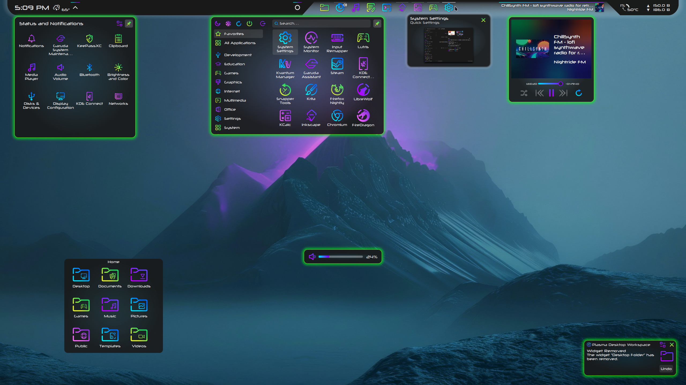
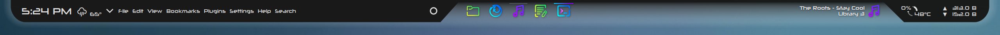
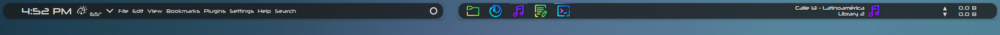
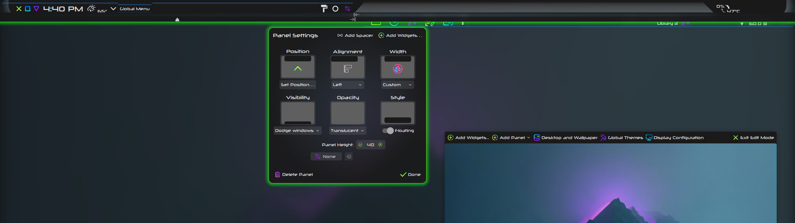
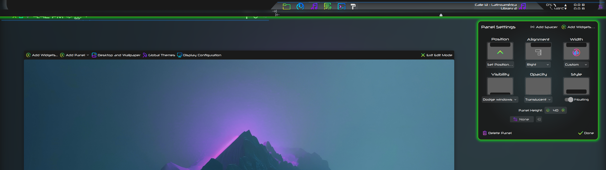

# Xeno Plasma Theme

Xeno is a dark theme for Plasma with colorful gradients and a cyberpunk glow. Features a radial background gradient.

Screenshots above depict a Plasma Panel using the [Xeno Conky theme](https://github.com/tully-t/Xeno/tree/main/Conky) and the [Plasma Transparency Button](https://store.kde.org/p/2150916)

Screenshot below depicts a Plasma Panel without using the [Xeno Conky theme](https://github.com/tully-t/Xeno/tree/main/Conky) and the [Plasma Transparency Button](https://store.kde.org/p/2150916)

## Installation

- Download and extract [Xeno-main.zip](https://github.com/tully-t/Xeno)
- Open the Plasma folder
- Copy the Xeno folder to ~/.local/share/plasma/desktoptheme, or use the dialog at System Settings -> Colors & Themes -> Plasma Style -> "Install from File..." (top right) to browse for Xeno-main/Plasma/Xeno.tar.gz
- We now have a ~/.local/share/plasma/desktoptheme/Xeno
- In System Settings -> Colors & Themes -> Plasma Style, select Xeno and click Apply

## Notes

- The pictured panel background is provided by the [Xeno Conky theme](https://github.com/tully-t/Xeno/tree/main/Conky)

## Recommendations

- Use with the Xeno Conky theme (provides panel background)
- Window decoration: Xeno
- Kvantum theme: Xeno
- Color scheme: Xeno
- Icons: [Sours](https://github.com/tully-t/Sours)
- Font: [Neuropolitical](https://www.dafont.com/neuropolitical.font)
- Blur:

    - In System Settings -> Workspace Behavior -> Desktop Effects, find the Blur row and ensure it is checked.
    - Press the customize button on the right to open the Blur Settings dialog window
    - Set Blur Strength to 5 (from left/Light)
    - Set Noise Strength to 3 (from left/Light)

### Plasma Panel configuration
- Dimensions:
    - Height: 40
    - Width: Custom
    - Style: Floating
- Transparency: use [Panel Colorizer](https://store.kde.org/p/2130967) to make the panel background transparent, it also allows for margin correction and provides a drop shadow for the dock icons and media player
- The top panel with center dock in the screenshots actually consists of two side-by-side panels with a custom width, one left-aligned and one right-aligned
- On Wayland, two side-by-side panels can be achieved by avoiding the 'Always Visible' Visibility option (I use Dodge Windows) (bug: https://bugs.kde.org/show_bug.cgi?id=477939)
- In edit mode, use the 'Drag to change maximum/minimum width' sliders to align the panels on either side of the middle slant
- Use [Panel Spacer Extended](https://www.pling.com/p/2128047) for explicit control over spacer length and additional panel actions (e.g. scroll to change volume (kmix), double-click to maximize/restore windows)
- Left Panel (from left):
    - Panel Spacer Extended (fixed size: 31px, tooltip disabled, hover effect disabled)
    - Window Buttons (use metrics from decoration, slide out, show when active window maximized, left - margin: 0, right margin: 4px)
    - Digital Clock (font: 18pt Neuropolitical)
    - Panel Spacer Extended (fixed size, 6px, tooltip disabled, hover effect disabled)
    - [Weather Widget 2](https://github.com/blackadderkate/weather-widget-2) (modified) (font style: - Neuropolitical, font size: 26px)
    - System Tray
    - Global Menu
    - Panel Spacer Extended (flexible size, tooltip disabled, hover effect disabled)
    - Panel Colorizer (enabled, hide widget, panel background: hide)
        - Layout: Background Margin (Spacing: 4, Vertical: 4, Horizontal: 0)
        - Layout - Extra Margin: Global Menu (Vertical: 1, Horizontal: 0)
    - Simple Application Launcher
- Right Panel (from right):
    - Panel Spacer Extended (fixed size: 32px, tooltip disabled, hover effect disabled)
    - [Netspeed Widget](https://store.kde.org/p/2136505) (modified) (upload first, use shortened speed units)
    - Panel Spacer Extended (flexible size, tooltip disabled, hover effect disabled)
    - Panel Colorizer (enabled, hide widget, panel background: hide)
        - Text and Icons (enabled, static color mode, fix custom badges)
            - Colors (source: system, color: text, color set: view, opacity: 1.0)
            - Shadow (enabled, color: #69000000, strength: 6, x offset: 1, y offset: 1)
        - Blacklist: Netspeed Widget
        - Layout: Background Margin (Spacing: 4, Vertical: 4, Horizontal: 0)
        - Layout - Extra Margin: Icons-only Task Manager (Vertical: -4, Horizontal: 0)
    - Icons-only Task Manager (_not_ filling free space on panel, for compatibility with Panel Spacer Extended flexible size, and set icons to appear to the right)
- Screenshots of Plasma Panel configuration:

### Keep Conky below other windows/panels

- To keep Conky underneath the panel as a background, use a Window Rule to force Conky to the 'Below' window layer:
    - In System Settings -> Window Management -> Window Rules, click "Add New..."
    - For "Window class (application)", select "Exact Match" and type `conky`
    - Click "Add Property..." and select "Layer" at the very bottom
    - Use the dropdown menu to change "Normal" to "Below", then click "Apply"

## Customization

- Always make a backup first

- Feel free to experiment! Make the theme work for you

- Use Inkscape to modify .svg or .svgz files. Modification using a text editor is not particularly recommended, except for solving specific problems, like using the 'Find' or 'Find & Replace' functions to modify colors. The 'Find & Replace' function is powerful, and can have unintended consequences.

- Inkscape element IDs like `mask-left` are critically important to Plasma themes - this [documentation](https://develop.kde.org/docs/plasma/theme/theme-svg/) from KDE gives a thorough explanation

- To modify the color of the dialog shadow, you only need to edit the `shadow-top` and `shadow-topleft` elements of Xeno/dialogs/background.svg, the other shadow elements are all clones of those two (the same applies for the shadow in Xeno/widgets/tooltip.svg)

- To see your changes to the currently-selected Plasma theme applied, you can switch to a different theme and then switch back, log out and log back in, or restart entirely.

- If you are struggling with glitches or gaps, check this [documentation](https://develop.kde.org/docs/plasma/theme/quickstart/#hints-and-tips) from KDE

### Known Issues

- A completely transparent panel background is not achievable except through the use of a plasmoid like [Panel Colorizer](https://store.kde.org/p/2130967). A properly transparent .svg is unfortunately perceived by Plasma as invalid(?) and instead the panel area is filled with the Window BackgroundNormal color from the color scheme.

### Contributing

Please open an issue if you notice any bugs, errors, or unexpected behavior.

### License

This project is licensed under the GNU GPL v3 - see the [LICENSE.md](LICENSE.md) file for details.

### Acknowledgments

The Xeno Plasma theme is originally inspired by [Sweet](https://github.com/EliverLara/Sweet-kde) ([EliverLara](https://github.com/EliverLara)), with inspiration in the code from [Lavanda KDE](https://www.pling.com/p/2009354) and [WhiteSur-Dark](https://store.kde.org/p/1400409) by [vinceliuice](https://github.com/vinceliuice), and [Iridescent](https://store.kde.org/p/1640895) by [rkstrdee/ddh4r4m](https://github.com/ddh4r4m/Iridescent)
