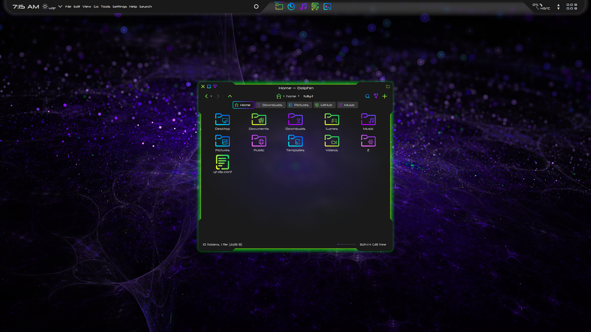
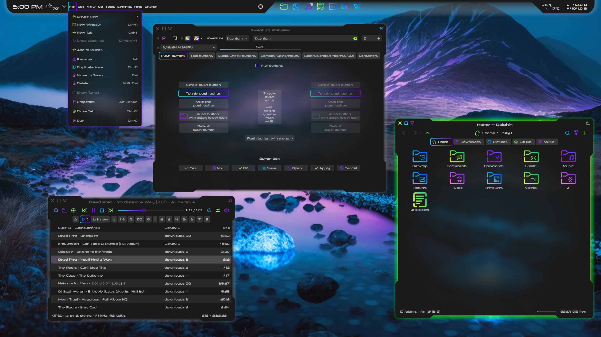
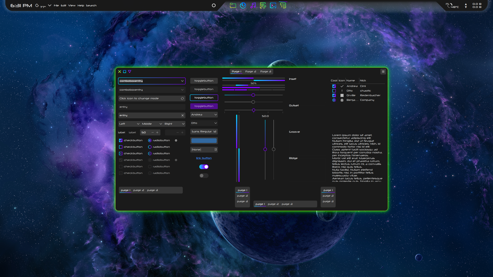
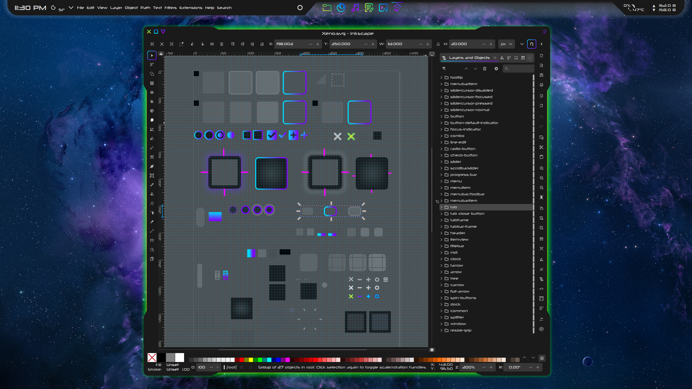

# Xeno Theme Suite

Xeno is a dark suite of themes for KDE with colorful gradients, tempered transparency, and a cyberpunk glow. This theme is developed with a commitment to chasing the pipe dream of a unified visual experience across Qt, Kirigami, and GTK.

## In this repository, you'll find

- Xeno Aurorae window decoration theme
- Xeno Kvantum theme
- Xeno Color scheme for KDE
- Xeno Plasma theme
- Xeno Conky theme
- Xeno-gtk GTK theme

Intended for use with the [Sours](https://github.com/tully-t/Sours) icon set and the [Xenofox](https://github.com/tully-t/Xenofox) theme for Firefox.

Font: [Neuropolitical](https://www.dafont.com/neuropolitical.font)

## Installation

Each component folder contains a README with installation instructions, recommendations, and customization notes specific to that component.

### Preview

### Contributing

Please open an issue if you notice any bugs, errors, or unexpected behavior.

### License

This project is licensed under the GNU GPL v3 - see the [LICENSE.md](LICENSE.md) file for details.
