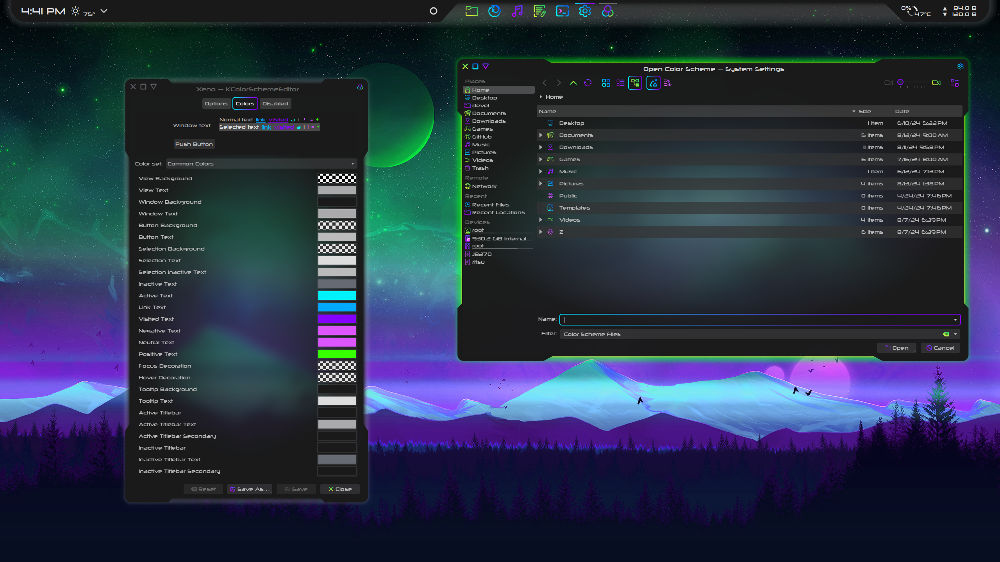
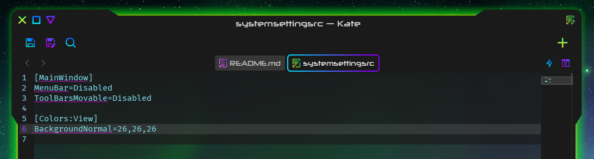
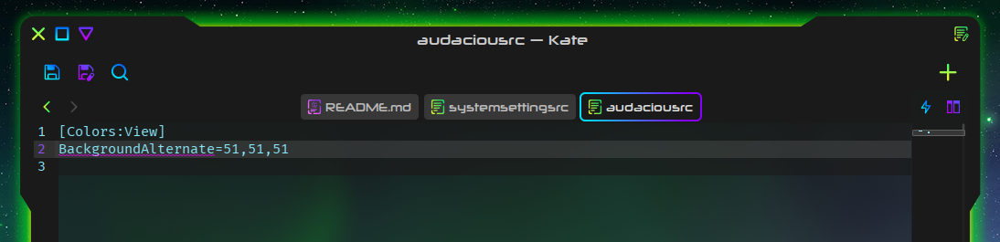
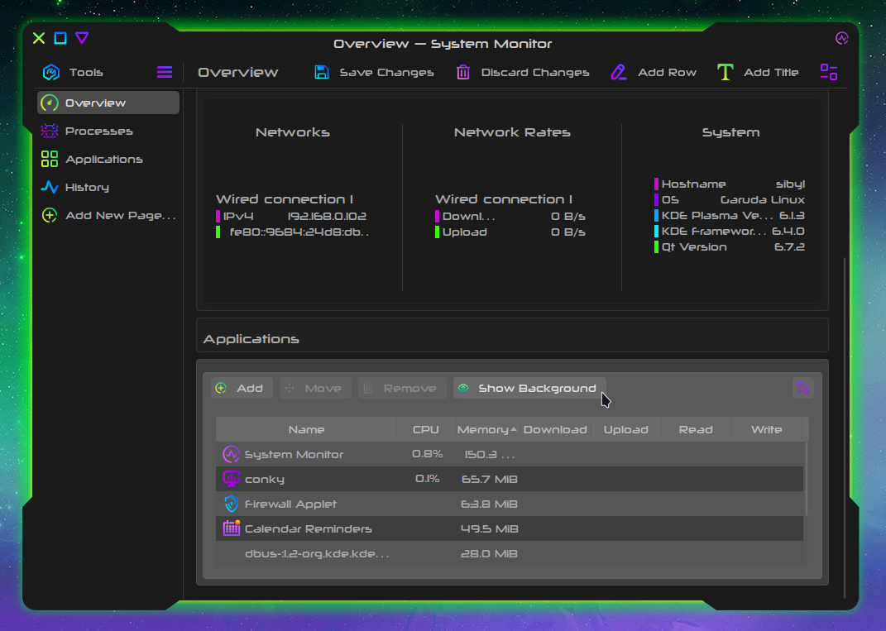

# Xeno Color Scheme

A color scheme for KDE to compliment the Xeno Kvantum theme.

## Installation

- Download and extract Xeno-main.zip
- Open the color-schemes folder
- Copy Xeno.colors to ~/.local/share/color-schemes
- In System Settings -> Appearance -> Colors, select Xeno and click Apply (lower right)

or

- Use the "Install from File..." dialog at System Settings -> Appearance -> Colors, and then Apply

## Xeno-Opaque

There are specific instances where the pursuit of transparency produces unexpected results.

- If that sounds scary, choose Xeno-Opaque

### Explanation

In the Xeno color scheme, the particular combination of an opaque `BackgroundNormal` in the `[Colors:Window]` section with a transparent `BackgroundNormal` in the `[Colors:View]` section allows for QtQuick/Kirigami apps to stay as consistent as possible to Kvantum-themed Qt/QtWidget/QtQML apps with a blurred window background without introducing unwanted transparency, except for modal dialogs. Modal dialogs include: the autocomplete popup in Kate, the Edit Pages dialog in System Monitor, and the text input dialog for "Command or Script..." Keyboard Shortcuts in System Settings. They have a completely transparent, unblurred background with the Xeno color scheme applied. Modal dialogs make fairly rare appearances, but when they do appear without a background, the experience can be jarring. What can be done about this?

- Option 1: Use the Xeno color scheme, and modify specific app settings (author's choice)

    - Where you encounter problematic transparency with Xeno, modify the configuration of that app
    - Some Qt apps, like Kate, allow the user to set the color scheme of the app, which you can set to Xeno-opaque
    - Other Qt apps, like System Settings or Audacious, will read colors from their rc file, located in ~/.config (e.g. for System Settings, this file is named systemsettingsrc)
        - To add a color to an app's rc file, copy it from the color scheme. Include both the section and the color in the section that you want to change. To fix modal dialogs in System Settings, open ~/.config/systemsettingsrc, add a line, and below it paste `[Colors:View]`. Below [Colors:View] paste `BackgroundNormal=26,26,26` and ensure the file ends with an empty line: 

        You can make a similar change to get the alternate rows in Audacious just right: 

    - System Monitor widgets (like the Application list) are a special case. They will not be affected by a color in the ~/.config/systemmonitorrc file, but they do provide a way to overcome unexpected transparency with a "Show Background" option in Edit mode: 

    - For apps where full window opacity is unavoidable, like System Monitor or Audacious, consider setting their per-app Kvantum theme to Xeno-Opaque under Application Themes in Kvantum Manager

Option 2: Apply the Xeno-Opaque color scheme in System Settings, however:

- This will apply the Xeno-Opaque theme globally, which will come with consequences for transparency: in addition to modal dialogs, the `BackgroundNormal` within `[Colors:View]` colors the background of the KDE file chooser, the widgets in OpenRGB, the applications list widget on the Overview page of System Monitor, some dividers and frames in QtQuick apps, and the side panels of config windows/settings dialogs.

TL;DR: Xeno-opaque introduces unexpected opacity, solving one problem but creating another. You can make changes to specific apps instead to have the best experience with Xeno.

## Customization

- Always make a backup first

- Feel free to experiment!

- When using a Kvantum theme, colors in Qt apps are provided by the Kvantum theme (both in the .svg image and the 'General Colors' section of the .kvconfig file). As a result, the KDE color scheme appears only where the Kvantum theme does not. Among other peculiarities, it fully colors QtQuick/Kirigami apps (like System Settings, System Monitor, and Elisa), and the text in apps like KCalc and in window titlebars.

- Use a text editor rather than the System Settings dialog to edit Xeno.colors. The color picker dialog only allows for opaque colors, but editing Xeno.colors directly as a text file makes it possible to add a fourth number, the alpha value (RGB -> RGBA)

    For example, `DecorationFocus=170,170,172` will give a solidly opaque #aaaaac white, while `DecorationFocus=170,170,172,86` will give a transparent #aaaaac56 white, the same color but at 33.7% opacity.

- It is unfortunate that the separator/frame color for QtQuick/Kirigami apps is sourced from the text color `ForegroundNormal` in `[Colors:Window]`. The consequence of this is that in QtQuick/Kirigami apps, separators and text have equal visibility and contrast - for example, System Settings cannot have both visible text and invisible separators

- App colors are determined from several sources. You may be better served by making modifications to your Kvantum theme first, and then carrying your changes over to your KDE color scheme, since the KDE color scheme is essentially subordinate to the Kvantum theme. To match things up across your entire system, you will then want to carry your changes over to your Plasma theme, and your GTK theme (if you don't use Breeze), and your [custom Firefox theme](https://github.com/tully-t/Xenofox), if you use one.

## Known Issues

- Modal dialogs, like the Edit Pages dialog in System Monitor, are both unblurred and fully transparent without intervention

### Contributing

Please open an issue if you notice any bugs, errors, or unexpected behavior.

### License

This project is licensed under the GNU GPL v3.
